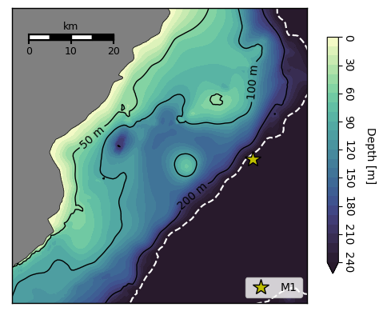

# M1 mooring 

#### Mooring

The M1 mooring was located near 79N 35', 28E 05', on the slope southwest of
Nordaustlandet and near the entry of the trough to Hartogbukta. 

Data from two deployments are available. The mooring was redeployed in September
2020 andis planned to be recovered and redeployed again in November 2021.

**CTD instruments:**

(*Concerto:* Conductivity (-> Salinity), Temperature, Pressure. *Solo*: Temperaure only)

**Current profilers:**

(*RDI 150 kHz*s are moored near the bottom and cover most of the water column.
*Signature 500 kHz*s are near the surface (looking up) and capture the upper layer).

#### Time series

(Figure from other manuscript in prep: )

*7-day averaged time series from the M1 mooring. a) Sea ice concentration from UoB AMSR2, b) Depth-averaged current vector from the RDI150 instrument (29 m to 231 m depth), c) currents along the direction of maximum subtidal variance (positive/blue 45.2° CCW of E), d) in-situ temperature, and e) Absolute Salinity. In d) and e), mean position of RBR Concerto instruments during the two deployments are indicated with black triangles on either side. The position of RBR Solo instruments (whose vertical position is less certain) is indicated with black triangles.*

