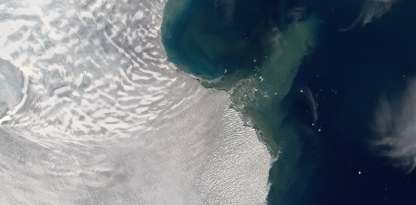

# glacierocean-austfonna

Exploring glacier-ocean interactions at Austfonna glaciers terminating in the northern Barents Sea.

Experimenting with using the gitlab infrastructure for project management.

*Hartogbukta, screenshot from TopoSvalbard*

