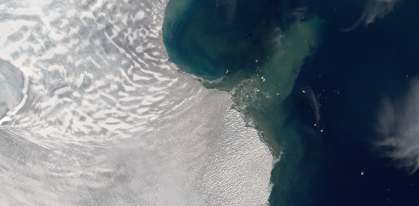

# glacierocean-austfonna

Curiosity-driven exploration of glacier-ocean interactions at Austfonna glaciers terminating in the northern Barents Sea.

Experimenting with using the gitlab infrastructure for project management.

*Hartogbukta, screenshot from TopoSvalbard*

- [Literature](literature/literature.md)
- [Bathymetry](bathymetry/bathymetry.md)
- [M1 mooring](M1_mooring/m1_mooring.md)
- [Glaciers](glaciers/glaciers.md)
- [Looking at glaciers-ocean-atmosphere in combination](multivars/multivars.md)
- [1D Plume model](plume_model/plume_model.md)
- [Data and sampling](data/data.md) 