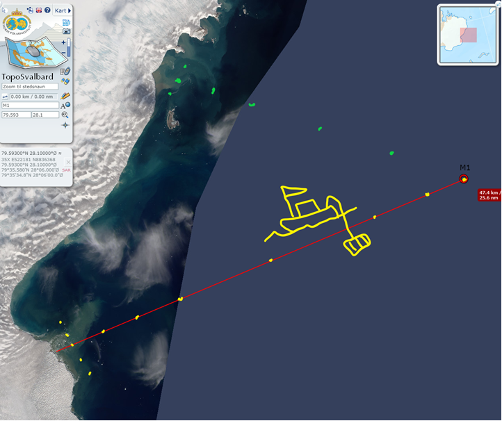
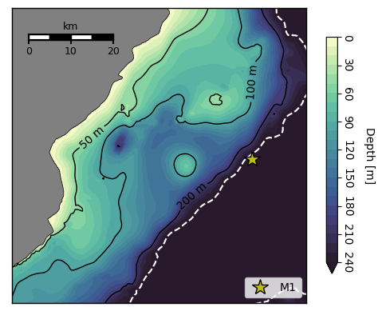

# glacierocean-austfonna

Exploring glacier-ocean interactions at Austfonna glaciers terminating in the northern Barents Sea.

Experimenting with using the gitlab infrastructure for project management.

- [Literature](literature/literature.md)
- [M1 mooring](M1_mooring/m1_mooring.md)

*Hartogbukta, screenshot from TopoSvalbard*

