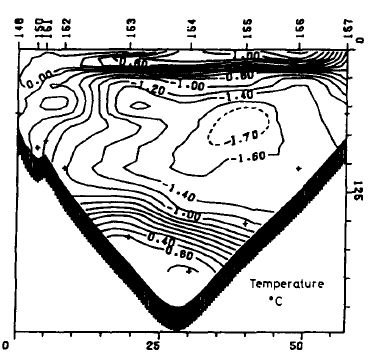
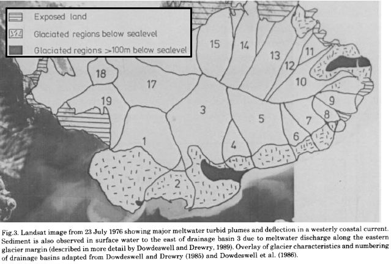

### Literature

An overview of relevant papers (not clear what has been done here previously).

**Dowdeswell et al 2015:**
*Sediment-rich meltwater plumes and ice-proximal fans at the
margins of modern and ancient tidewater glaciers:
Observations and modelling*

 https://onlinelibrary.wiley.com/doi/pdf/10.1111/sed.12198 - *Sedimentology* 

Detailed study of sediment plumes from the Nordaustlandet margin, including Hartogbukta. Based on satellite imagery, geophysical data and modelling - no ocean observations. 

Use the *SedPlume* model to look at sediment transport. As far as I can tell, the plume part of this is the Morton 1956 buoyant plume (half-cone, probably), but with no melting. They don't seem to specify where they get the stratification from.

**Robinson & Dowdeswell 2011:** 
*Submarine landforms and the behavior of a surging ice cap since the last glacial maximum: The open-marine setting of eastern Austfonna, Svalbard*

https://www.sciencedirect.com/science/article/pii/S0025322711001319 - *Marine Geology*

Show detailed bathymetry from Hartogbukta - looks like there is an opening to about 100 m.

**Pfirman & Solheim 1989:** *Subglacial meltwater discharge in the open-marine tidewater glacier environment: observations from Nordaustlandet, Svalbard Archipelago*

https://www.sciencedirect.com/science/article/abs/pii/0025322789900893- *Marine Geology*

Includes CTD observations off the plume on the southern coast of Nordaustlandet. These observations are from 1981 and 1982 - the time of year is not specified. The transect shown suggests very cold temperatures.

Also suggests that much of the terminus area is located below sea level - some below 100 m.

 

 
