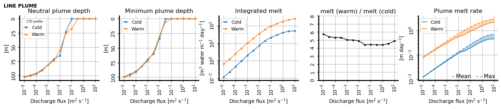
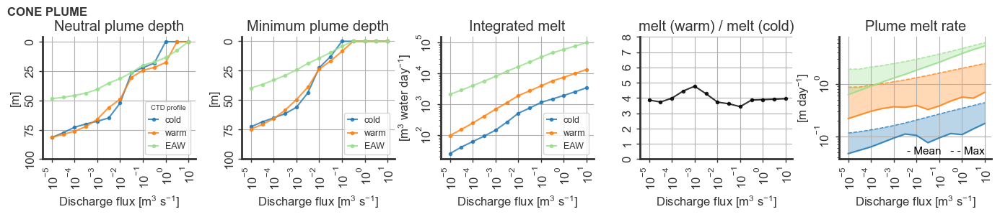

# Effect of increasing the freshwater discharge volume

####Setup

We perform some plume model experiments using the *cold*, *warm*, and *EAW* ambient
ocean profiles. Those, and all other parameters, are equal to those on [this
page](../test_experiments/plume_test_experiments.md).

We run the experiments for both line plumes and an axisymmetric (half-cone) plumes.

Lacking a good sense of the volume of subglacial discharge, we vary the discharge between 0.0001 and 10 with steps given by 

    V0 = 10^(n/2) for n = (-10, -3, .., +1, +2)

For a line plume, V0 is the freshwater discharge per unit glacier width, in
units m2/s.  For a cone plume, V0 is the total freshwater discharge, in units
m3/s. 
 
####Results

**Notes**
- As expected, increased freshwater discharge results in shallower terminal plume
depth and increased melt. 
- A plume in a *warm* ambient ocean generates substantially more melt than in an
identical *cold* ocean.
    - *Warm* generates around 5 (4) times more melt than *cold* for a line
      (cone) plume.
    - This relationship is relatively invariant of initial freshwater discharge.
