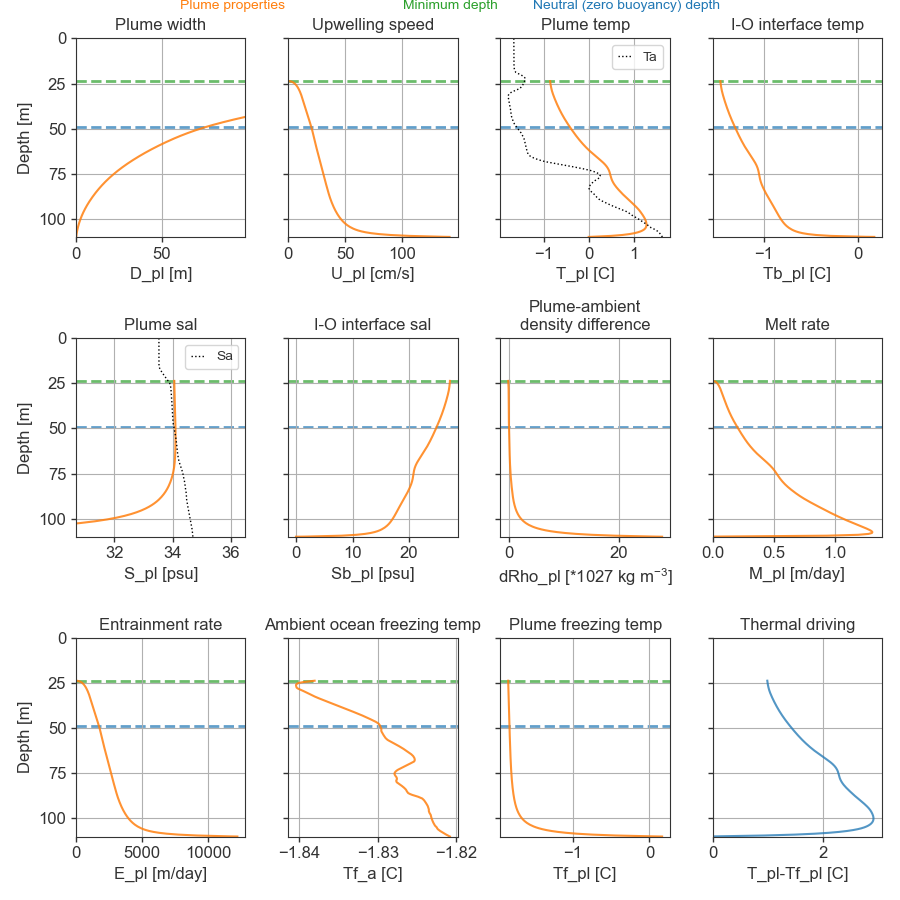

# Initial test experiments with the plume model

Playing around with the 1D plume model to get a sense of the sensitivity of
Nordaustlandet glaciers to changes in the ambient ocean.

This is not meant as a rigourous or physically realistic modeling exercise -
just as a first order test exmeriment to get a sense of the process and
sensitivities.

Code and output in: 

    work/projects/barents_glaciers/code/plumemod_test/

### Boundary conditions

##### Ambient ocean profiles

We use two CTD profiles of temperature and salinity collected near M1 in
November 2019 as ambient ocean bondary conditions. Profile *Warm* was collected
near the M1 mooring and has obvious AW influence. Profile *Cold* was collected
further southeast, away from the sloping bathymetry, and lacks a mid-depth
temperature maximum.

In addition, we ran experiments with a third profile, *Extreme AW*. collected in
the AW current north of Svalbard in September 2018. This profile, is included
as a limit case representing a more "undiluted" AW profile.
 
Profiles were smoothed with a 9-point (= 9 db) running mean before they were used in
numerical experiments. If the shallowst profile measurements were below the
surface, the profiles were extended to 0 m depth assuming a uniform top layer.  

##### Plume initial conditions

We consider a line plume with an initial freshwater discharge of at 110 m depth. We set
the initial temperature and salinity to *T=0, S=0*, emulating sugblacial
discharge of glacial meltwater. We assume a vertical glacier face, and set
coefficients to relatively uncontroversial  values, including:

- Entrainment coefficient: 0.1
- Glacier ice temperature: -2 C
 
 **Volume flux**

In this example, we use an initial volume flux 0.01 m2 s-1 (line plume)   
0.01 m3 s-1 (cone plume).

An exploration of the relationship between plume properties/melt and discharge
volume is found [here](../effects_of_incr_disch/effects_of_incr_disch.md).

### Example plumes

#### Line plume

###### *Plume initialized with* **warm** *ambient ocean profile and discharge 1e-2 m2 s-1:*

    ## RESULTS: ##

    Neutral depth: 55.5 m
    Minimum depth: 29.4 m

    Plume temperature at neutral depth: 0.15 C
    Ambient temperature at neutral depth: -1.44 C
    Plume salinity at neutral depth: 34.19 psu
    Ambient salinity at neutral depth: 34.11 psu
    Plume speed at neutral depth: 0.22 m/s

    Initial T, S: 0.00 C, 0.00 psu

    Initial volume flux: 0.010 m² s⁻¹
    Upward volume flux at neutral depth: 1.503 m² s⁻¹

    Integrated melt up to terminal depth: 0.000 m² s⁻¹
    Integrated melt up to neutral depth: 0.000 m² s⁻¹

    Integrated entrained ambient water up to terminal depth: 1.878 m² s⁻¹
    Integrated entrained ambient water up to neutral depth: 1.491 m² s⁻¹

    At terminal depth (neutral depth or surface), the plume consists of:
    Bottom volume flux (0.67%) / Meltwater (0.02%) / Entrained ambient water (99.31%)

###### *Plume initialized with* **cold** *ambient ocean profile and discharge 1e-2 m2 s-1:*

    Neutral depth: 64.8 m
    Minimum depth: 33.6 m

    Plume temperature at neutral depth: -1.18 C
    Ambient temperature at neutral depth: -1.56 C
    Plume salinity at neutral depth: 34.07 psu
    Ambient salinity at neutral depth: 34.06 psu
    Plume speed at neutral depth: 0.25 m/s

    Initial T, S: 0.00 C, 0.00 psu

    Initial volume flux: 0.010 m² s⁻¹
    Upward volume flux at neutral depth: 1.294 m² s⁻¹

    Integrated melt up to terminal depth: 0.000 m² s⁻¹
    Integrated melt up to neutral depth: 0.000 m² s⁻¹

    Integrated entrained ambient water up to terminal depth: 1.767 m² s⁻¹
    Integrated entrained ambient water up to neutral depth: 1.300 m² s⁻¹

    At terminal depth (neutral depth or surface), the plume consists of:
    Bottom volume flux (0.76%) / Meltwater (0.00%) / Entrained ambient water (99.23%)

#### Half-cone plume

###### *Plume initialized with* **warm** *ambient ocean profile and discharge 1e-2 m2 s-1:*

    ## RESULTS: ##

    Neutral depth: 49.0 m
    Minimum depth: 23.7 m

    Plume temperature at neutral depth: -0.42 C
    Ambient temperature at neutral depth: -1.61 C
    Plume salinity at neutral depth: 34.09 psu
    Ambient salinity at neutral depth: 34.03 psu
    Plume speed at neutral depth: 0.20 m/s

    Initial T, S: 0.00 C, 0.00 psu

    Initial volume flux: 0.010 m³ s⁻¹
    Upward volume flux at neutral depth: 1838.407 m³ s⁻¹

    Integrated melt up to terminal depth: 0.022 m³ s⁻¹
    Integrated melt up to neutral depth: 0.013 m³ s⁻¹

    Integrated entrained ambient water up to terminal depth: 18015.134 m³ s⁻¹
    Integrated entrained ambient water up to neutral depth: 2324.872 m³ s⁻¹

    At terminal depth (neutral depth or surface), the plume consists of:
    Bottom volume flux (0.00%) / Meltwater (0.00%) / Entrained ambient water (100.00%)

###### *Plume initialized with* **cold** *ambient ocean profile and discharge 1e-2 m2 s-1:*

    ## RESULTS: ##

    Neutral depth: 52.3 m
    Minimum depth: 22.5 m

    Plume temperature at neutral depth: -1.37 C
    Ambient temperature at neutral depth: -1.85 C
    Plume salinity at neutral depth: 33.98 psu
    Ambient salinity at neutral depth: 33.95 psu
    Plume speed at neutral depth: 0.19 m/s

    Initial T, S: 0.00 C, 0.00 psu

    Initial volume flux: 0.010 m³ s⁻¹
    Upward volume flux at neutral depth: 1625.193 m³ s⁻¹

    Integrated melt up to terminal depth: 0.006 m³ s⁻¹
    Integrated melt up to neutral depth: 0.003 m³ s⁻¹

    Integrated entrained ambient water up to terminal depth: 20662.852 m³ s⁻¹
    Integrated entrained ambient water up to neutral depth: 1904.741 m³ s⁻¹

    At terminal depth (neutral depth or surface), the plume consists of:
    Bottom volume flux (0.00%) / Meltwater (0.00%) / Entrained ambient water (100.00%)

